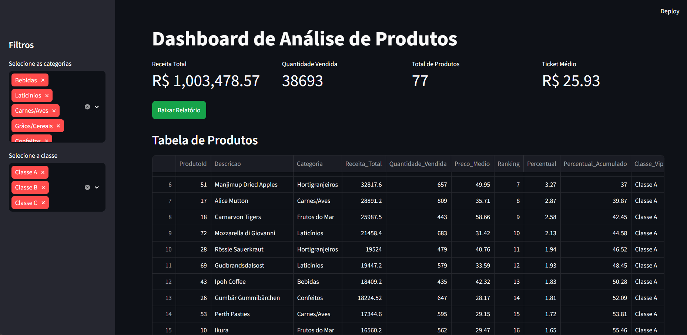
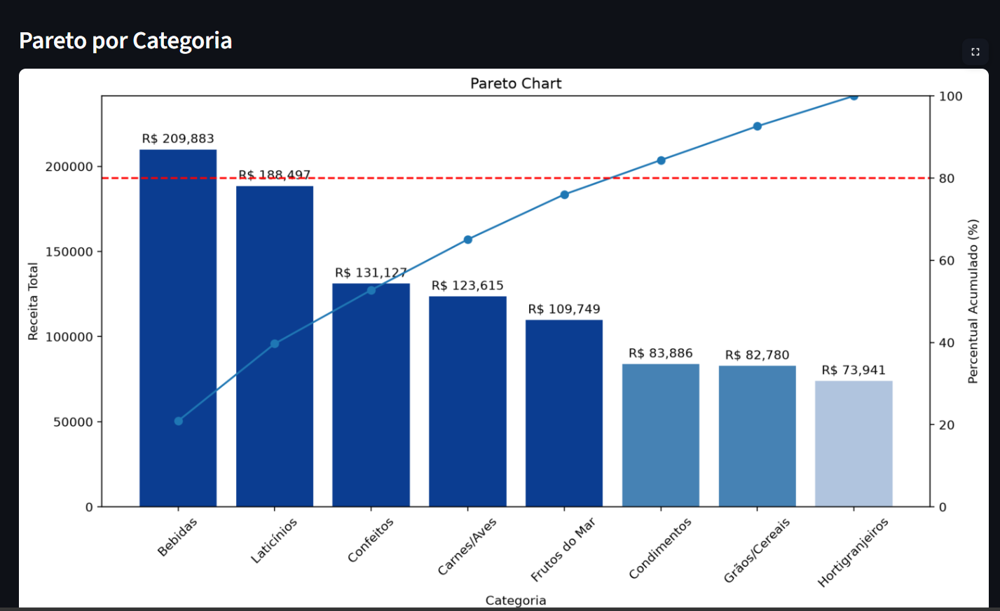
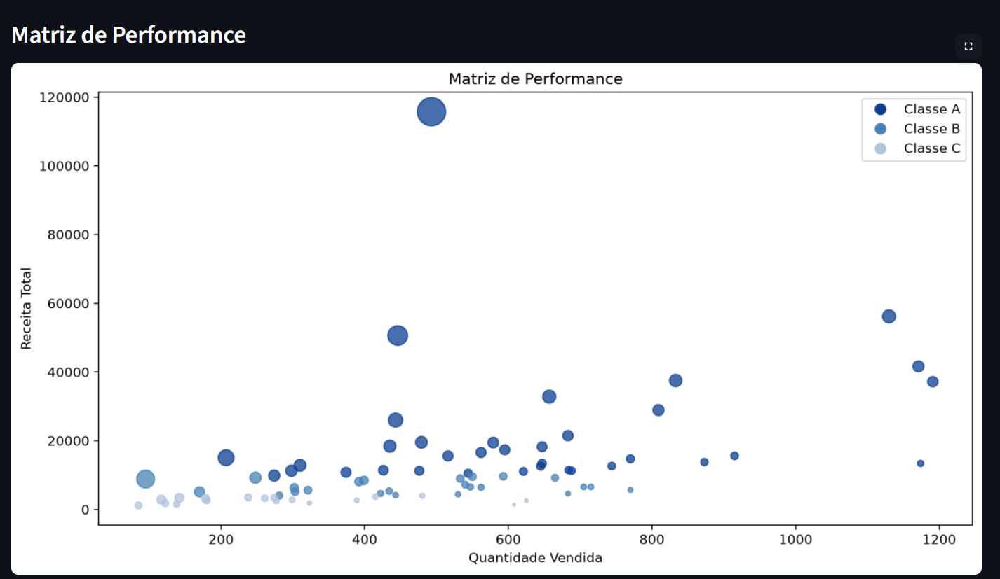

# Dashboard de Análise de Produtos

- Classe A representa 79.13% da receita
- Classe B representa 15.82%
- Classe C representa 4.69%

Isso permite:

- Melhor controle de estoque
- Priorização de produtos
- Otimização de compras
- Decisões estratégicas

## Preview do Dashboard

### Dashboard Geral

### Pareto por Categoria

### Matriz de Performance

### KPI de Concentração

[KPI](images/kpi-concentracao.png)

## Autor

Daniel Carvalho

Desenvolvedor Python | SQL | Data Analytics
